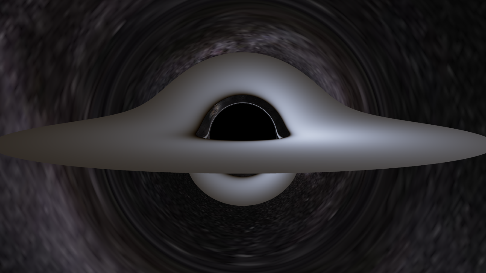
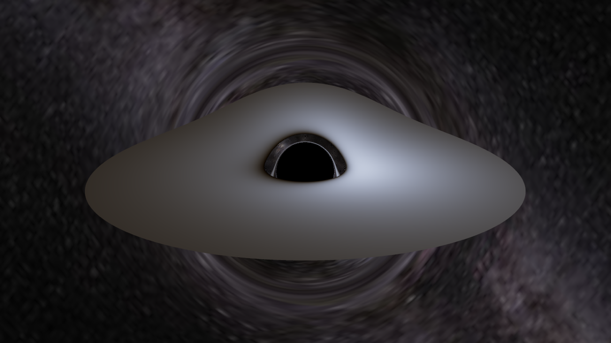

# Schwarzschild black hole renderer

A black hole renderer written from scratch in C++, with no rendering engine underneath it.
Light does not travel in straight lines near a black hole, so every pixel fires a photon
backwards from the camera and integrates its null geodesic through Schwarzschild spacetime
until it crosses the horizon, strikes the accretion disk, or escapes to the sky. The shapes
in the image come out of that integration and not out of post-processing.

There are two binaries: `raytracer` writes a PNG, and `viewer` opens a window you can orbit
around while it renders.



The default scene. The disk runs from the ISCO at 6M out to 36M, seen from 100M away and 6
degrees above the disk plane. The band arcing over the shadow is the far side of the disk,
bent over the hole by gravitational lensing, and the arc below it is that same far side seen
from underneath.



The same scene from 17 degrees up. The dark circle is roughly 2.6 times wider than the
horizon itself, since photons passing near the photon sphere at `r = 3M` still fall in.

## The physics

Spherical symmetry means every photon stays in a single plane through the origin, so the
trajectory reduces to one second-order ODE in `u = 1/r` against the orbital angle:

```
d²u/dφ² = 3Mu² − u
```

RK4 integrates it with a fixed step in φ. The `3Mu²` term is the whole difference between
this renderer and a flat-space one: drop it and you get straight lines back.

One subtlety costs a few percent if you miss it. The camera hands the tracer a direction
measured in the local orthonormal frame of a static observer, but `u` and `φ` are
coordinates. Proper radial length is `dr/√(1−2M/r)` while proper tangential length is
`r dφ`, so the initial slope is

```
du/dφ|₀ = −√(1−2M/r₀)·cos ψ / (r₀ sin ψ)
```

Use the naive Euclidean ratio of the direction components instead and the first integral
`(u′)² + u² − 2Mu³ = 1/b²` stops closing, which shows up as a critical impact parameter a
few percent off the analytic value.

The disk is a standard thin disk with a no-torque inner boundary at the ISCO, radiating the
full Page-Thorne relativistic flux rather than the Newtonian profile. It is optically thick,
so a photon stops at its first equatorial crossing and nothing behind that contributes. The
crossings themselves have a closed form: height above the disk plane is
`r(φ)·(e₁ᵧ cos φ + e₂ᵧ sin φ)` and `r` is always positive, so the zeros are the zeros of a
pure sinusoid and no root finding against the ODE is needed.

Colour comes from the Planck spectrum integrated from 380 to 780 nm against fits to the CIE
1931 colour matching functions, then converted to linear sRGB. From there, shading the disk
comes down to one number. The redshift factor

```
g = 1 / (u^t (1 − Ω·b_axis))
```

folds gravitational redshift, Doppler shift and relativistic beaming together, and a
blackbody at temperature `T` seen with factor `g` is exactly a blackbody at `gT`. Bolometric
intensity scales as `g⁴`, and `σ(gT)⁴ = g⁴σT⁴`, so the shifted temperature alone carries
both the colour and the brightness. That is why the approaching side of the disk is bluer
and brighter and the receding side is redder and dimmer, without any of it being applied by
hand.

Escaping photons sample an equirectangular star map in their outgoing direction. If the
texture is missing, a procedural starfield stands in, so a render never depends on an asset
being present.

## Checking that it is right

A black hole render is easy to make look plausible and hard to make correct, so most of the
work went into checks that a pretty picture cannot pass.

`raytracer` bisects on the emission angle to find the capture and escape boundary and prints
the critical impact parameter on every run. Schwarzschild says it must be `√27 M`:

```
b_crit (numeric)  = 5.19615   analytic sqrt(27) = 5.19615   rel.err = 2.66924e-12
```

In a bare render with the camera at 30M and a 40 degree field of view, the shadow measures
105.0 pixels in radius against 104.92 predicted from the camera geometry, which checks the
whole pipeline and not just the tracer in isolation. The redshift factor over the disk in the
default scene runs from
0.472 to 1.404, against analytic limits for tangential emission at the ISCO of 0.471 and
1.414. Star elongation near the ring was checked by connected-component analysis rather than
by eye: the major axes come out 87 to 89 degrees from radial with the axis ratio falling from
4.7 near the ring to 2.2 at the frame edge, which is lensing shear and not an artefact of the
starfield generator.

The multithreaded render is bit-identical to the single-threaded one and reproducible across
runs, which is the actual proof that no race or ordering dependence crept in.

For the viewer, "it launched without crashing" is worth nothing, since a blank window passes
that test. `./build/viewer --selftest` renders one frame into a hidden window, uploads it,
draws it, reads the pixels back with `glReadPixels` and writes `viewer_selftest.png`.
Compared against the offline render at the same resolution, the readback came back identical
with a maximum channel difference of 0, so the upload, shader, sampling and vertical flip are
all lossless.

## Building

```bash
cmake -S . -B build
cmake --build build
```

You need CMake 3.20 or newer and a C++20 compiler. `stb` and GLFW are pulled in by
`FetchContent` and pinned to specific commits, so the first configure needs network access
and nothing has to be installed by hand.

Developed on macOS with Apple clang. The offline renderer is portable C++, but the `viewer`
target links the macOS OpenGL framework directly; building it elsewhere means swapping that
one line in `CMakeLists.txt` for your platform's GL library and a loader such as glad.

## Running

```bash
./build/raytracer
```

Reads `scene.cfg` and writes `output.png`. Pass a different path to use another scene file.
A missing file falls back to the built-in defaults, and malformed lines are reported with a
line number and skipped instead of aborting the render.

```bash
./build/viewer
```

Drag to orbit, scroll to zoom, press S to save a full-quality PNG of the current view, Esc to
quit. While the camera moves it renders at quarter resolution with a coarse integration step,
then climbs a four-rung ladder back to full resolution once you stop. Auto-exposure is damped
over time, because recomputing the luminance percentile per frame makes the whole image pulse
while you orbit.

## Configuring a scene

Everything lives in `scene.cfg`. Lengths are in units of M with `G = c = 1`, which puts the
horizon at `r = 2`, the photon sphere at `r = 3` and the ISCO at `r = 6`.

```
width            = 800
height           = 450
samples_per_axis = 3      # rays per pixel per axis; 1 to iterate fast, 3 to ship

disk_r_inner = 6.0        # the Page-Thorne flux profile assumes this is the ISCO
disk_r_outer = 36.0
disk_t_peak  = 10500.0    # kelvin at the flux maximum, near r = 9.55

camera_distance  = 100.0
camera_elevation = 6.0    # degrees above the disk plane; small = nearly edge-on
camera_fov       = 24.0

trace_d_phi   = 0.01      # integration step; lower buys sky accuracy, costs time
trace_phi_max = 40.0      # in units of pi: cutoff for photons trapped near the ring
```

## Performance

Measured on an Apple M5 with 10 logical cores. Offline renders use 3x3 supersampling:

| what | resolution | time |
|---|---|---|
| offline | 800 x 450 | 1.27 s |
| offline | 1920 x 1080 | 7.2 s |

The viewer at one sample per pixel, with `d_phi = 0.10` and the spiral cutoff at 8π:

| resolution | frame rate |
|---|---|
| 640 x 360 | 86 fps |
| 960 x 540 | 40 fps |
| 1280 x 720 | 23 fps |

Roughly 93% of the time sits inside the integrator, at about 275 RK4 steps per ray, which
decides where optimisation is worth doing and where it is not. Threads take rows from an
atomic counter instead of being handed equal blocks, because the cost of a row varies by
orders of magnitude: a row grazing the photon ring spirals for thousands of steps while a row
of open sky finishes immediately. The blackbody conversion is a 1024-entry lookup table,
which keeps `exp` and `pow` out of the hot path entirely. The tracer itself runs in `double`
throughout: a photon's escape direction is sensitive enough that `float` visibly degrades the
background.

## Limitations

Schwarzschild only, so no spin. Kerr geodesics are not planar, which is exactly what the
orbital-plane reduction assumes, so it needs the full Christoffel formulation and a larger
state vector. The seams are prepared for it: the RK4 stepper is a template over the state
type, and `trace_photon` is the interface to keep.

The bundled star map is 1280 x 640, about 0.28 degrees per texel against 0.054 degrees per
render pixel, so the background is visibly soft. Any higher-resolution equirectangular map
dropped in at `sky_texture` fixes that with no code change.

The disk has no thickness and no volumetric structure, and since it is optically thick, only
the first crossing is ever visible.

## Layout

```
include/    headers
  vec3.h        vectors
  ray.h         origin + direction
  camera.h      pinhole model, builds the orthonormal basis
  integrator.h  RK4, templated over the state type
  geodesic.h    photon state, fate, and the tracer interface
  disk.h        accretion disk, Page-Thorne flux, blackbody colour
  sky.h         equirectangular star map with a procedural fallback
  image.h       framebuffer and PNG output
  renderer.h    the threaded render loop, auto-exposure, tone mapping
  config.h      scene file parsing
src/        implementations, plus main.cpp and viewer.cpp
assets/     the star map
scene.cfg   the scene
```

`renderer.cpp` holds the loop that both binaries call, so the interactive view and the
offline render trace with identical code and the offline path stays usable as the reference.

## Credits

This project was sparked by this ([video](https://www.youtube.com/watch?v=8-B6ryuBkCM&pp=ygUmSSBidWlsdCBhIGJsYWNrIGhvbGUgc2ltdWxhdGlvbiBpbiBjcHA%3D)) from kavan.

The background is the ESO / S. Brunier all-sky Milky Way panorama
([eso0932a](https://www.eso.org/public/images/eso0932a/)).

Image I/O uses [stb_image and stb_image_write](https://github.com/nothings/stb) by Sean
Barrett. The interactive window uses [GLFW](https://www.glfw.org/). Everything else,
including the vector math, the camera, the integrator and the colour science, is written
here.
